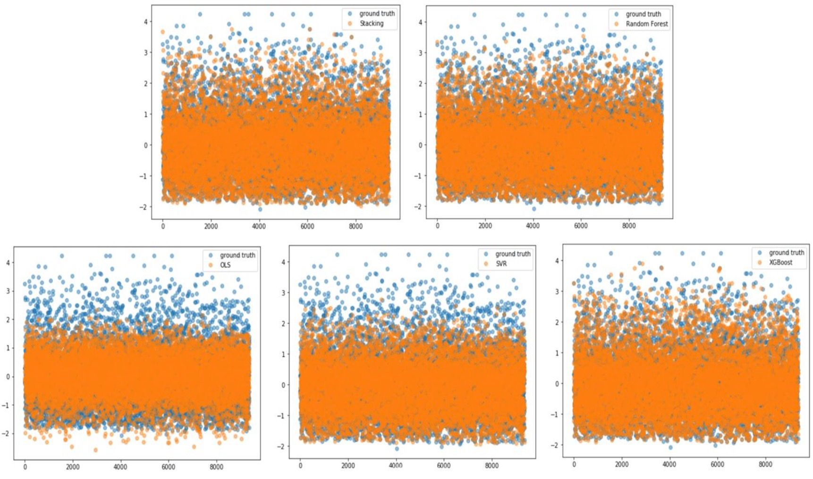
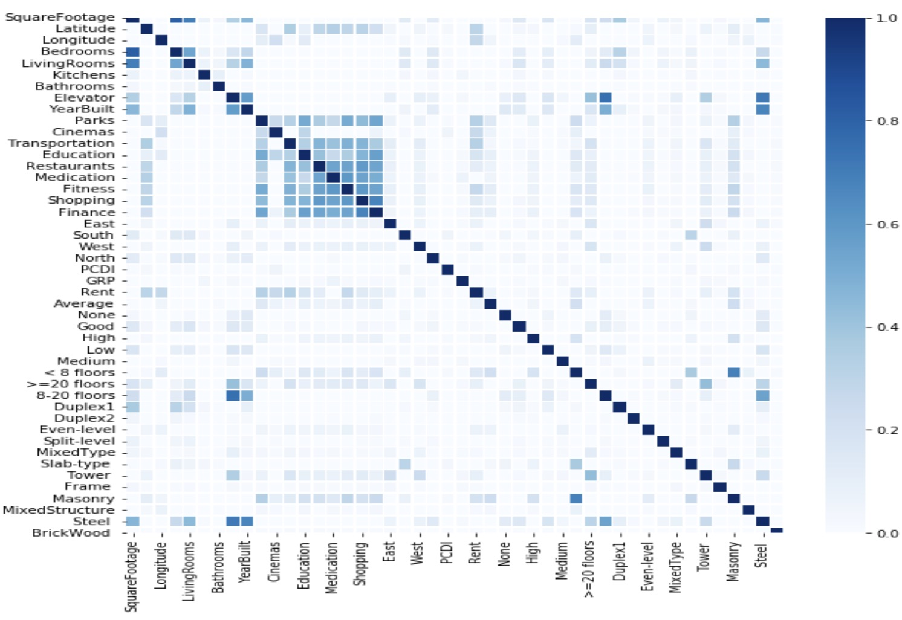
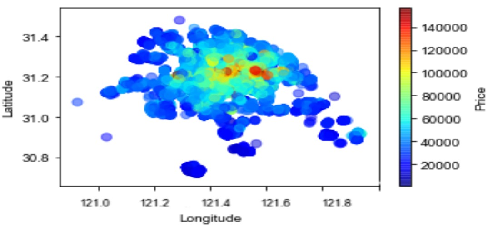
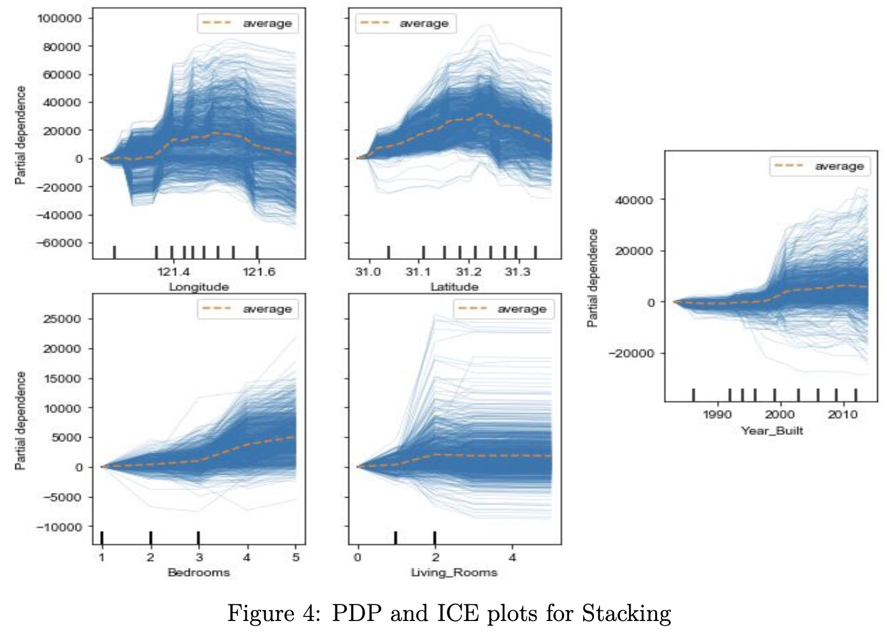

# Shanghai Second-hand House Price Prediction

## Overview
This project involves scraping second-hand housing data from the [Lianjia website](https://sh.lianjia.com/) for the city of Shanghai and predicting housing prices using machine learning models. It integrates web scraping, data processing, feature engineering, and predictive modeling techniques to provide insights into the real estate market trends in Shanghai.

### Key Methods

- **Web Scraping**: 
  - Scraped housing data from the [Lianjia website](https://sh.lianjia.com/) using `requests`, `lxml`, and `re`, and stored it in CSV format.
  
- **Data Processing**: 
  - Processed the scraped data and integrated macroeconomic data using `pandas` for feature engineering.
  
- **Machine Learning Modeling**: 
  - Implemented machine learning models including Linear Regression, Stacking, Random Forest, XGBoost, and SVR using `scikit-learn`.
  
- **Evaluation and Visualization**: 
  - Evaluated model performance using metrics such as Mean Absolute Error (MAE), Mean Squared Error (MSE), Root Mean Squared Error (RMSE), and R-squared.
  - Used `matplotlib` for visualization.
  - Generated Partial Dependence Plots (PDP) and Individual Conditional Expectation (ICE) plots using `sklearn`'s `partial_dependence` and `plot_partial_dependence` to examine relationships between house prices and housing attributes.

## Implementation

### Crawler
- **File**: [`crawler.py`](https://github.com/zy969/LianjiaHousePricePrediction/blob/main/crawler/crawler.py)
- **Description**: Scrapes second-hand housing data from Lianjia, extracting house title, price, type, floor, area, structure, orientation, building type, renovation condition, and geographical coordinates. Uses [Baidu Map API](https://lbsyun.baidu.com/) to fetch data on nearby amenities (public transport, medical, entertainment, education, lifestyle). Stores collected data in CSV for analysis and model training.

### Data Processing and Feature Engineering
- **File**: [`add_macro_variables.py`](https://github.com/zy969/LianjiaHousePricePrediction/blob/main/processor/add_macro_variables.py)
- **Description**: Integrates macroeconomic data (house prices, CPI, etc.) with transactional data from the crawled CSV. Matches data based on time and region, combines into a DataFrame, and exports to a new CSV.

- **File**: [`data_processing.py`](https://github.com/zy969/LianjiaHousePricePrediction/blob/main/processor/data_processing.py)
- **Description**: Loads raw data, parses housing info, integrates amenities data (transport, education, dining, medical, fitness, shopping, finance, entertainment). Creates columns for integrated amenities info, selects key columns (region, price, square footage, etc.). Excludes "N/A" values, encodes columns, handles exceptional values, normalizes selected columns, and saves processed data into a new CSV.

### Evaluation
- **File**: [`evaluation.py`](https://github.com/zy969/LianjiaHousePricePrediction/blob/main/evaluation/evaluation.py)
- **Description**: Contains code for data visualization, model training, prediction, and evaluation. Assesses model performance and visualizes trends and relationships in the data.

## Results

### Model Performance
In terms of model performance, the Stacking model outperformed others.
| Model Name        | Linear Regression | Stacking  | Random Forest | XGBoost | SVR    |
|-------------------|-------------------|-----------|---------------|---------|--------|
| MAE               | 0.4998            | 0.3244    | 0.1981        | 0.1989  | 0.1052 |
| MSE               | 0.4535            | 0.1981    | 0.1095        | 0.1147  | 0.06734|
| RMSE              | 0.6734            | 0.3309    | 0.3169        | 0.3387  | 0.1971 |
| R-squared         | 0.5340            | 0.8874    | 0.8821        | 0.7494  | 0.8918 |

### Scatter Plots
 
### Correlation Heatmap
The correlation heatmap shows the relationship between features. 

### Price Heatmap based on Longitude and Latitude
 

### Example PDP and ICE Plots
